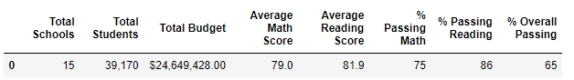
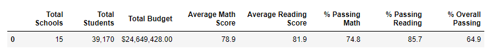

# Election_Analysis	

##Project Overview

Analyze test results from a city school district. The code provides reports that show insights and patterns related to student funding and standardize test results within the school district. The data used in this analysis was recorded from 15 schools and reported just over 39,000 students.  There where two analyses ran due to some concerns over the accuracy of the data pertaining to the ninth-grade test results for one of the smaller charter schools included in the analysis.

##Resources	

-Data Source: schools_complete.csv, students_complete.csv
-Software: Python 3.7.11, IPython 7.29.0, Jupyter Notebook 6.4.6, Anaconda 4.11.0

##Results

There where about seven key metrics that where tabulated within the report.  It is important to note there where 461 test results that have been deemed potentially unreliable and where unincluded in the final version of the report but were included in the original version of the report. However, that is only 1.2% of the entire student population so it had very little weight on the final metrics.  At a cursory glance the 9th grade students at Thomas High Schools (THS) do seem to be outperforming their peers which would suggest the grades have been altered.
- In the first report included the students in question for a total of 39,170 student, the second report excluded those 461 students so only 38,709 results where actually used to calculate the other metrics
- The total budget of the school district remains unchanged in both reports and holds steady at $24,649,428.00
- The average math score did change slightly after dropping THS nine graders from the calculation, but only by a tenth of a point from almost an even 79.0 to 78.9.  Further analysis would be recommended considering the small number of results omitted from the final tabulation
-The average reading score remains steady throughout both reports and holds higher than math at 81.9
- The percentages of student passing math fell slightly when omitting the THS ninth grade results, from 75% overall including the THS test scores in question, to 74.8% excluding THS test scores in question.
- The percentages of students passing reading also fell slightly when omitting the THS ninth grade test results from 86% including the THS test scores to 85.7% excluding the test scores in question.
- The overall percentage of students passing both standardized tests fell slightly when excluding the test results in question from 65% passing to 64.9% passing without the THC ninth grade test results included in the average.

Below is an overview snapshot of the two analyses the first one includes THS ninth grade test results and the second excludes THS ninth grade test results:

With THS ninth-grade test results:

Without THS ninth-grade test results:

##Summary

While the THC ninth grade test results only slightly changed the overall metrics four key metrics where effected:
- Average math scores fell from 79.0 to 78.9
- Percentage of students with passing math scores fell from 75% to 74.8% 
- Percentage of students with passing reading scores fell from 86% to 85.7%
- Percentage of student padding both math and reading fell from 65% to 64.9%

It is also important to note that the smaller school performed much better than larger schools with schools under 2000 students having around 90% of their students pass both reading and math while larger schools between 2000-5000 students only had 58% of their students pass both reading and math.  Another interesting observation is that performance had little to do with the budget to student ratio and the less a school spent in relation to its student population the higher the test scores where overall. Charter schools also outperformed district schools with around 90% of charter schools passing both math and reading, while only 54% of district school students passed both math and reading. 
